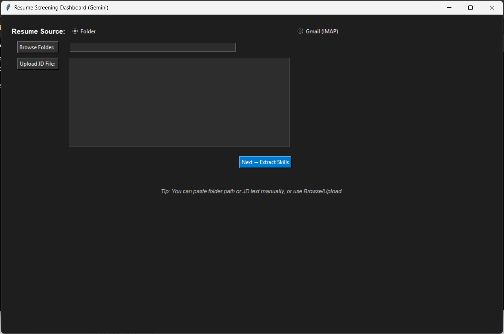

# 📊 Resume Screening Dashboard (with Google Gemini + Gmail IMAP)

An AI-powered resume screening tool built with **Tkinter**, **Google Gemini API**, and **Gmail IMAP**.
It extracts skills from a job description, parses resumes (PDF/DOCX/TXT), ranks candidates by skill match using **TF-IDF + cosine similarity**, and provides **interactive charts + Excel export**.

---

## ✨ Features

* 📝 **Job Description Parsing** – Extracts relevant skills using **Google Gemini** (with fallback keyword matching).
* 📂 **Resume Sources**:

  * Local **folder of resumes**
  * Directly fetch resumes from **Gmail (IMAP, with App Password)**
* 📑 **Resume Parsing** – Reads PDF, DOCX, TXT, extracts **name, email, years of experience**.
* 📊 **Scoring & Ranking** – Matches resumes against JD skills with **cosine similarity**.
* 📈 **Dashboard** – Tkinter UI with:

  * Resume table (Top 20 ranked)
  * Horizontal bar charts:

    * Resume score distribution
    * Skill coverage across top candidates
* 📤 **Export** – Saves results to Excel:

  * `all_resumes_<timestamp>.xlsx`
  * `top20_resumes_<timestamp>.xlsx`

---

## 🚀 Setup

### 1️⃣ Clone the Repository
```bash
git clone https://github.com/yourusername/resume-screening.git
cd resume-screening
````

### 2️⃣ Create a Virtual Environment (Recommended)

```bash
python -m venv venv
source venv/bin/activate   # On Linux/Mac
venv\Scripts\activate      # On Windows
```

### 3️⃣ Install Requirements

All dependencies are listed in `requirements/requirements.txt`.
Install them with:

```bash
pip install -r requirements/requirements.txt
```

---

### 4️⃣ Configure Gemini API

* Get your API key from [Google AI Studio](https://aistudio.google.com).
* Set it as an environment variable:

  ```bash
  export GEMINI_API_KEY="your_api_key_here"   # Mac/Linux
  setx GEMINI_API_KEY "your_api_key_here"     # Windows
  ```

  Or hardcode into the script:

  ```python
  GEMINI_API_KEY = "your_api_key_here"
  ```

### 5️⃣ Gmail Setup (optional)

* In Gmail → **Settings → Forwarding and POP/IMAP → Enable IMAP**
* Generate an **App Password** (NOT your normal password):

  * Go to [Google Account → Security → App Passwords](https://myaccount.google.com/apppasswords)
  * Choose **Mail → Device: Other → Name it “ResumeApp”**
  * Copy the 16-digit password

---

## ▶️ Run

```bash
python resume_screening_gemini.py
```

---

## 📦 Dependencies

The requirements file was auto-generated from the environment. It includes:

* pandas
* matplotlib
* google-generativeai
* docx2txt
* PyPDF2
* scikit-learn

(`tkinter` is part of Python’s standard library and doesn’t need to be installed via pip.)

---

## 🖼️ Screenshots (Step-by-Step)

### 1. Startup Screen

*Select Resume Source: Folder or Gmail*


---

### 2. Gmail Mode

*Enter Gmail + App Password, choose filters (Unread/Read/Both), Lookback days*


---

### 3. Job Description Input

*Upload JD (TXT/DOCX) or paste into the textbox*


---

### 4. Skill Extraction & Selection

*Skills extracted by Gemini – confirm or uncheck manually*


---

### 5. Results Dashboard

*Top 20 resumes ranked by JD match, with interactive charts*

* **Left:** Resume scores distribution
* **Right:** Skill coverage across candidates
  

---

## 📂 Output

* Excel files generated:

  * `all_resumes_<timestamp>.xlsx`
  * `top20_resumes_<timestamp>.xlsx`

---

## ⚠️ Notes

* If `GEMINI_API_KEY` is not set, fallback keyword extraction is used.
* Gmail fetching works **only with App Passwords** (normal passwords won’t work).
* Supports `.pdf`, `.docx`, `.txt` resumes.

---

## 🛠️ Tech Stack

* **Python** (Tkinter, pandas, scikit-learn, matplotlib)
* **Google Gemini API** (for JD skill extraction)
* **IMAP (imaplib)** for Gmail resume fetch

---

## 📜 License

MIT – Feel free to fork, modify, and use 🚀

---
